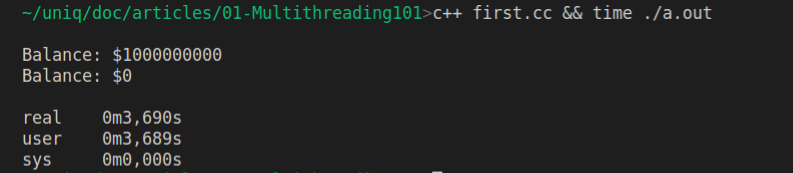

#Multithreading 101

This is the first of a series I intent to write about multithreading programming in modern C++ using STL classes and in the context of the [UniQ][1] library. Being a smooth introduction to its features and also to C++ programming in general.

In this first article, to set a common starting point to our practical experiments, we'll se how to start threads, use atomic variables, locks/mutexes and conditional variables.

Even if you have no experience with C++ this is written for you. And, if you are a seasoned C++ programmer and want to get most of your computing power I think you can get some nece ideas.

In Linux, you may need to install the build essentials package, to get the c++ compiler and tools.

```
sudo apt-get update
sudo apt-get install build-essential
```

It should also work with other platforms running any C++17 compliant compiler.

##A Naive Banking System.

Lets suppose we are writing a banking system capable of deposits and withdrawals.

To simulate a concurrent environment, where our system should make millions of transactions per second receiving movements from different sources, we have an artificial restriction:

Our account system will only make movements of one dollar each transaction. (This will also be useful to do benchmarking.)

Here our first prototype:

```C++
// ... first.cc
void deposit(int &balance, int amount) { 
  for(auto i = 0; i < amount; i++) 
    balance++; 
};

void withdrawal(int &balance, int amount) { 
  for(auto i = 0; i < amount; i++) 
    balance--; 
};

int main(){
  
  int A = 0;
  
  cout << "\nDepositing a bilion dollars"<< A << "\n";
  deposit(A, 1e9);
  cout << "\nBalance: $"<< A << "\n";

  cout << "\nWithdrawing a bilion dollars"<< A << "\n";
  withdrawal(A, 1e9);     

  cout << "Balance: $"<< A << "\n";
}
```
Here we have two funcions: `deposit()` and `withdrawal()` called by the `main()` making two movements in the account `A` of a billion units each.

If your save the code above in a file named `first.cc` in your computer, you can compile and run it using the following command:

```c++ first.cc && time ./a.out```

After that, you should receive an output like this:



Lets understand what happened:

Our command has two parts (separated by `&&`)

First we call the `c++` compiler passing the name of our program `first.cc`. Second, we execute the binary of our program `a.out` using the `time` command to measure its execution time.

By default, the compiler saves the resulting binary executable in a file named `a.out` right next the source file. (This can be changed using the -o flag.)

## Benchmarks

In my computer (an Intel Core i7 @3.2GHz running Ubuntu 21.04), without optimizations, this program took near 3,7 seconds to be executed.

Let's do some math: If we divide 2 billion operations by the time taken 3,7 s we'll get the number of operations per second. In our case near 540M op/s for short.

If we do the inverse, we get the time taken for each transaction to be executed (1,85 nano seconds) near 6 clock cycles of the processor running at 3.2GHz.

<!-- This also is the maximum throughput of the system, and a interesting comparative ground. All future benchmarks are relative to this point. -->

<!--
operation | amout | time  | op time | clock cycles | M op/s
--- | --- | --- | --- | --- | ---
incremental loop| 1e9 | 3,7s  | 1,85 ns | 6 | 540|
 -->

That said, one may ask: But if I get 540 Mop/s using one core of our computer, what would happen if we make a multithreded version of it, running deposits and withdrawals simultaneously. Would it get faster? Lets see...

## Starting threads


```C++

#include <thread>
#include <iostream>
using namespace std;

int main(){

  thread A(deposit, 1e6);

  thread B(withdrawal, 1e6);

  A.join(); B.join();

  cout << balance << "\n";
}
```

Here, we started two threads `A` & `B`, each one running at the same time in an independent core of your computer.

The thread `A` simulate a very busy concurrent updates of the `balance` variables, a million times.

The thread `B` does the inverse, decrementing the variable `balance` a million times.

We could expect that, at the end, we should got zero. But every time I execute this program, I beceive a different result:


## The ABA problem

If you are at least familiar with parallel and concurrent programming, you know about it.

Where a thread `A` can be interrupted by another concurrent thread `B` and change the expected result of the first.

This is also called a *concurrency condition*, when two or more concurrent execution lines interfere with each other, competing for the same resource.


Now you got the joke:


<!-- To understand what this is and what we can do to  -->
> `Multithreading` The ability of a CPU to run multiple threads of execution concurrently.
> `Thread` A parallel execution line, running concurrently in the same system. Usually sharing resources.


## Atomic Registers & Concurrency

Being a seasoned programmer I bet you already know how to get a zero at the end of our example. and know that this problem happens because increment is not a naturally *atomic* operation.

<!-- Our example program produced its erratic behavior because the increment `balance++` aren't a *atomic* operation. -->

I mean, in the metal, to increment a variable, the processor breaks the operation in some other steps.

First the it fetches the value, then increment it, and then put it back in the original place. (or some other variation of this)

To allow the interaction between threads, they created what is called *atomic variables* or *atomic registers*.

But I think they are better thought as *atomic operations* because the atomicity means that the processor will guarantee that operation will succeed or fail as a whole.

There is a couple of ways to use atomic operations, but in the C++11 the easiest is use the STL's `std::atomic` template, where we can make other types atomic.

Its use is really simple, in our example, just replace the line
```
int balance = 0;
```
with
```
atomic<int> balance = 0;
```

And don't forget to add the header `<atomic>`
```
#include <atomic>
```

Now if we execute our changed example (or veit as noaba.cc) we get the satisfying 0.


### The overhead of atomic operations.

As everything in the life, atomic operations also had a cost. Usually they are about 5-10x slower then their non atomic relatives. Changing the count of the loop 100 million, I got the following 1s for the first and 7.1s for the last.

In the next session, we will understand what means a lock operations and what should be a lock-free one.